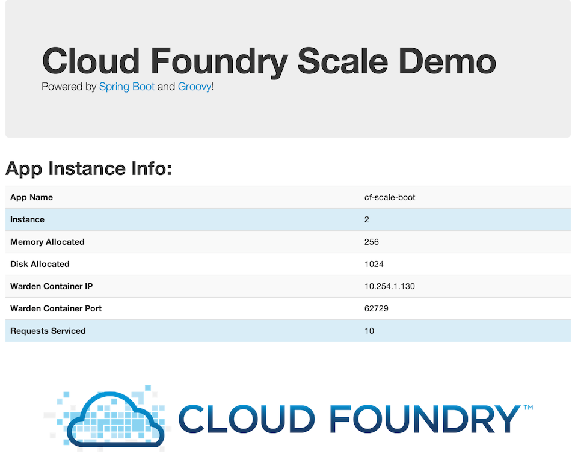

= cf-scale-boot

Demonstrate application instance scaling on Cloud Foundry with this simple Spring Boot CLI application!

== Running on Cloud Foundry

----
$ mvn package && cf push
----

== SCALE!

----
$ cf scale cf-scale-boot -i 1000
----

(_or some reasonable number for your CF cloud!_)

== What you get:

