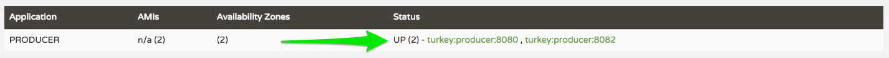

= Lab 07b - Declarative REST Clients with Feign

Estimated time to complete: 15 minutes
[abstract]
--
This lab is a small extension to the link:../../session_07/lab_07a/lab_07a.adoc[Ribbon lab]. It uses Netflix Feign for the REST calls.
We will use a declarative REST repository based on Feign.
It does not use Hystrix. You will therefore need to work with a new set of projects.

We will do the following:

. Improve the consumer application from link:../../session_07/lab_07a/lab_07a.adoc[Lab 07a] to use a `ProducerClient` enabled by Feign
. Test the new consumer version against our local pool of producers
--

== Setup

. Stop all the running applications and remove the corresponding projects from your IDE

. Inside your IDE, import the projects that have been placed for you inside $COURSE_HOME/day_02/session_07/lab_07b/initial/

NOTE: those projects are identical to the ones that you had completed at the end of the Lab 07a (Ribbon).

. Start your Eureka server and 2 producers as we have done in the previous labs. You SHOULD NOT start the consumer as of now. The below applications should be running:

. Once you are ready to go, ensure you have two instances of the producer service registered in Eureka (http://locahost:8761):
+

== Using Feign

. Change to the lab directory:
+
----
$ cd $COURSE_HOME/day_02/session_07/lab_07b/initial/springtrader-consumer
----
+
and import the project (via `pom.xml`) into your IDE of choice.

. Add the following dependency to `pom.xml`:
+
[source,xml]
----
<dependency>
	<groupId>org.springframework.cloud</groupId>
	<artifactId>spring-cloud-starter-feign</artifactId>
</dependency>
----

. Add a `@EnableFeignClients` annotation to the class `io.springtrader.consumer.SpringtraderConsumerApplication`.

. Create the interface `io.springtrader.consumer.ProducerClient` and into it paste the following code:
+
[source,java]
----
@FeignClient("producer")
public interface ProducerClient {

    @RequestMapping(method = RequestMethod.GET, value = "/")
    ProducerResponse getValue();
}
----

. Refactor the class `io.springtrader.consumer.ConsumerController` to autowire the `ProducerClient` instead of `RestTemplate`, and then use it to obtain the `ProducerResponse`:
+
[source,java]
----
@Autowired
ProducerClient client;

@RequestMapping(value = "/", produces = "application/json")
String consume() {
    ProducerResponse response = client.getValue();
    return String.format("{\"value\":%d}", response.getValue());
}
----

. Restart the `consumer` application by launching `SpringtraderConsumerApplication`

. Test the consumer application on http://localhost:8091/ and show that it is still receiving values from the producers. It should behave exactly like in the previous lab. The only difference is that your REST binding code is slightly more concise and elegant.
